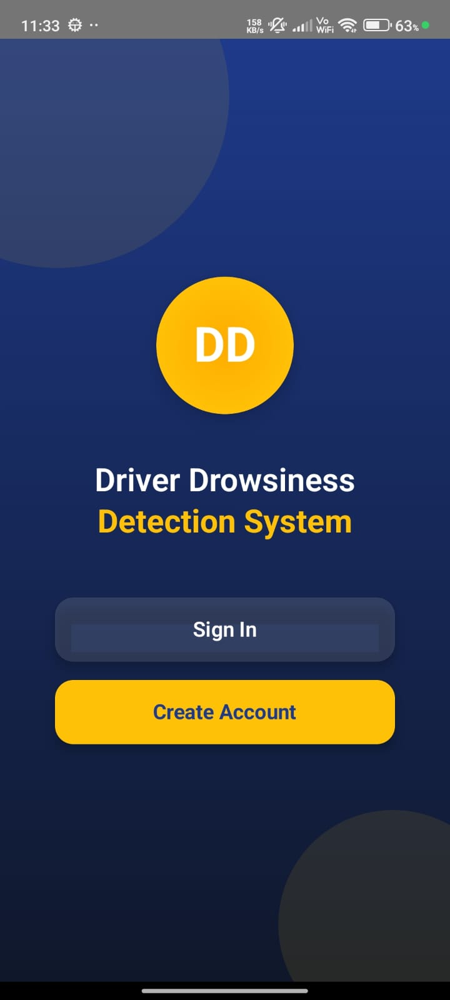

# 🚗 AlertDrive: Driver Drowsiness Detection Android App

**AlertDrive** is a real-time Driver Drowsiness Detection application designed to help prevent road accidents caused by driver fatigue.  
It uses a deep learning model deployed via a Flask backend and an Android app built with Kotlin, Jetpack Compose, and CameraX.

## 📸 Features

- Real-time driver monitoring via phone camera.
- Predicts **"Non-Drowsy"**, **"Drowsy"** and **"No Face Detection"** or states based on facial cues.
- Displays prediction confidence and extracted features.
- Alarm System, gets activated when driver feels **"Drowsy"**
- Minimalistic and intuitive UI for quick usability.
- Lightweight deep learning model combining EfficientNet and GRU for fast and accurate predictions.

## 🏗️ System Architecture

- **Backend (Flask Server)**:
  - Receives camera frames from the app.
  - Preprocesses and predicts driver state using a CNN+GRU model.
  - Sends prediction label, confidence score, and feature vector back to app.
  
- **Frontend (Android App)**:
  - Built with Kotlin and Jetpack Compose.
  - Uses CameraX API for real-time frame capture.
  - Automatically sends frames periodically to backend for prediction.
  - Displays results to the driver.

## 📱App Screenshots
Below are key app screens
### Login screen


## 🛠️ Setup Instructions

### 1. Clone the Repository

```bash
git clone https://github.com/devyansh22156/DriverDrowsinessDetection-Android-Application.git
cd DriverDrowsinessDetection-Android-Application
```

### 2. Set up the Flask Backend (Server)

Navigate to the `App_Server` directory:

```bash
cd App_Server
```

Install the required Python packages:

```bash
pip install -r requirements.txt
```

Run the Flask server:

```bash
python app.py
```

> **Important**:  
> - Make sure your server is running on the **same network** (WiFi or Hotspot) as your Android phone.  
> - Note your **IP Address** (for example, `192.168.1.5`) — you will need it in the next step.

### 3. Set up the Android App (Frontend)

Open the `app` directory in **Android Studio**.

- Open `app/src/main/java/com/example/driverdrowsinessdetection/ApiClient.kt`
- **Update the `BASE_URL`** variable with your computer's IP address and port (default Flask port is 5000):

```kotlin
private const val BASE_URL = "http://<your-ip-address>:5000/"
```

**Example:**

```kotlin
private const val BASE_URL = "http://192.168.1.5:5000/"
```

### 4. Build and Run the App

- Connect your Android device via USB with **developer mode** and **USB debugging** enabled.
- Press **Run** (▶️) in Android Studio to install the app on your device.
- Alternatively, **build an APK** and install it manually:
  - Build → Build Bundle(s) / APK(s) → Build APK(s)
  - Install the generated APK on your Android phone.

### 5. Using AlertDrive

- Open the app, login (dummy login currently), and navigate to the detection screen.
- Press **Start Auto Detect**.
- The app will automatically capture frames every 0.5 seconds and display predictions.
- If the driver is detected as **drowsy**, appropriate feedback can be triggered.

## 📚 Dataset Used

- **NTHU Driver Drowsiness Detection Dataset (NTHUDDD2)** — 66,500 images annotated for drowsy/alert conditions, with various lighting conditions and occlusions like glasses.

## 📈 Model Details

- **Spatial Feature Extractor**: Pretrained EfficientNet-B0 (ImageNet weights).
- **Fine-Tuned model weights**: https://drive.google.com/file/d/1gO5yMIWkIXpJ8abINwDpvyhF6pEXJJEz/view?usp=sharing
- **Temporal Feature Model**: Gated Recurrent Unit (GRU) layer on extracted spatial features.
- **Training**:
  - Optimizer: Adam
  - Loss: Binary Cross-Entropy
  - Early stopping and data balancing techniques used.
- **Achieved Accuracy**: ~99.65% on validation set.

## 🚀 Future Improvements

- Add interactive alert dashboard (e.g., vibrations, sounds).
- Explore Transformer-based temporal modeling.
- Integrate fatigue risk scoring over longer driving sessions.
- Extend support to wearable devices (like smartwatches).

## 🧑‍💻 Authors

- **Anikait Agrawal (2022072)**
- **Devyansh Chaudhary (2022156)**
- **Dhawal Garg (2022160)**

## 📄 License

This project is for academic and research purposes only.
